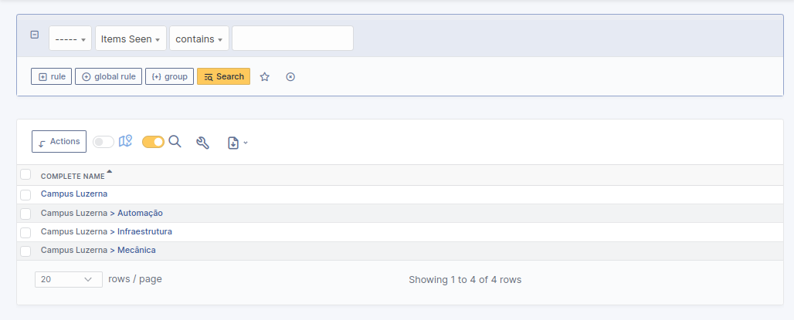
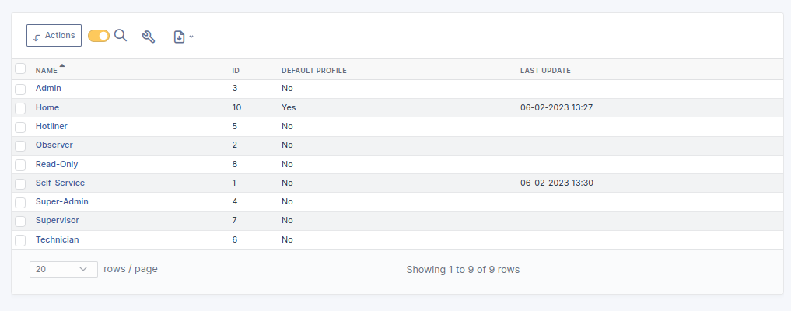
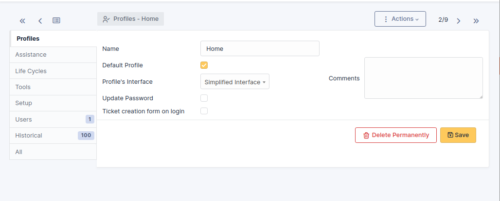
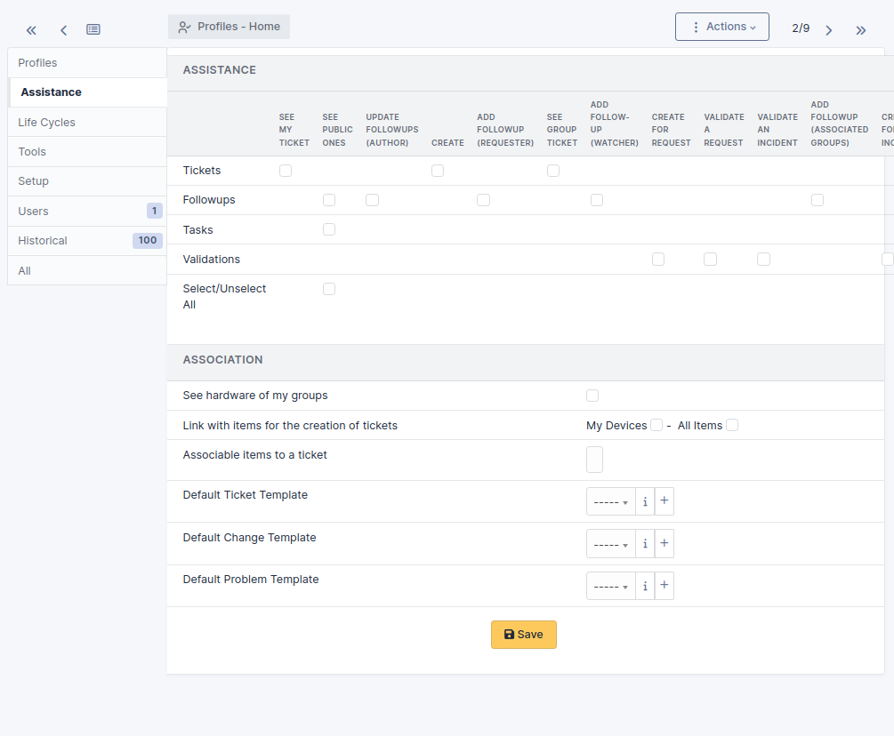
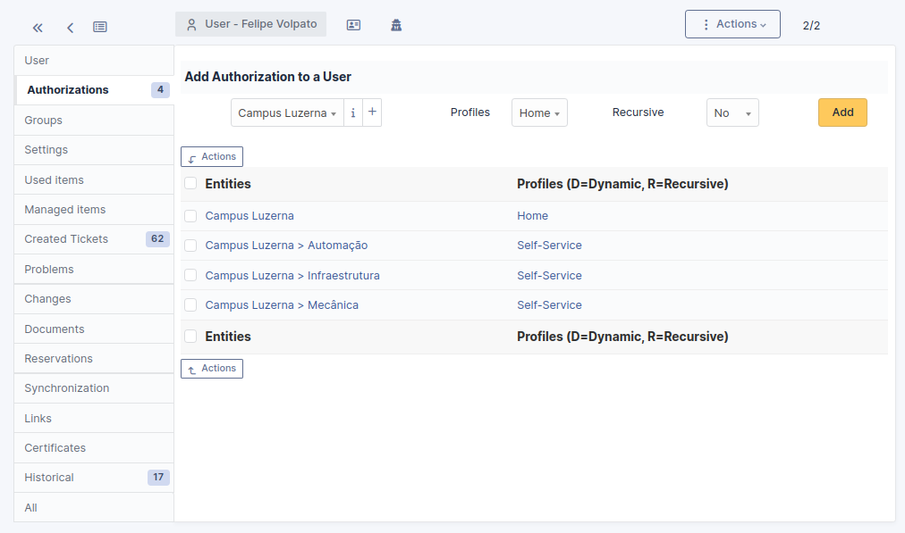

# php-glpi-mod

This is a modification for GLPI 10.0.x that allows users to open tickets in entities other than the root entity, accessing them through the buttons present in the "Home" profile. For this to be possible, this "Home" profile must be configured on the root entity. In this model, users cannot open tickets in the root entity, only in the sub-entities. In this model there are no people managing the root entity, only people in their departments/entities who are responsible only for them.

Prerequisites
-----------------------
  - A GLPI 10.0.x running instance

Config
-----------------------

The following represents a step by step to configure the glpi installation that will be modified:

  1) Organize your entities with at least one root entity and its subentities;
  2) Create a "Home" profile;
  3) On your "Home" profile main tab, set your fresh "Home" profile as the Default Profile;
  4) On your "Home" profile assistance tab, uncheck all the options;
  5) Last but not least, access Administration > Users and add the root entity with the home profile;
  

  

  

  

  

  

  

